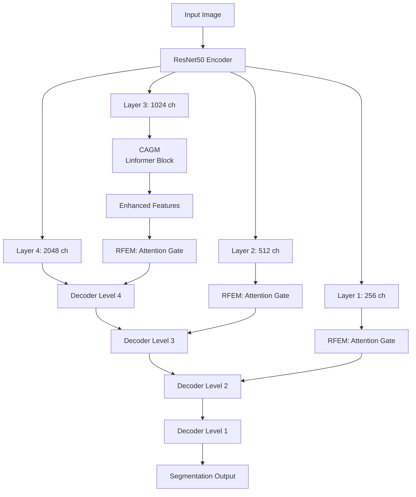

# Context-CrackNet

[](https://opensource.org/licenses/MIT)
[](https://www.python.org/downloads/)
[](https://pytorch.org/)

> **Context-CrackNet: A Novel Deep Learning Framework for Crack Segmentation Using Context-Aware Global Mechanisms**

A novel deep learning architecture for accurate crack detection and segmentation in pavement images. Context-CrackNet combines a ResNet50 encoder backbone with innovative **Context-Aware Global Module (CAGM)** using Linformer attention and **Refined Feature Enhancement Module (RFEM)** with attention-gated skip connections.

## 🏗️ Architecture



### Key Components

| Module | Description |
|--------|-------------|
| **CAGM** | Context-Aware Global Module using Linformer self-attention for capturing global context with linear complexity O(n·k) |
| **RFEM** | Refined Feature Enhancement Module implementing attention-gated skip connections for selective feature fusion |
| **ResNet50 Encoder** | Pretrained backbone for hierarchical multi-scale feature extraction |

## 📁 Project Structure

```
Context-CrackNet/
├── README.md                    # This file
├── LICENSE                      # MIT License
├── requirements.txt             # Python dependencies
├── config.yaml                  # Default configuration
│
├── src/                         # Source code package
│   ├── models/
│   │   ├── context_cracknet.py  # Main Context-CrackNet model
│   │   ├── components.py        # Encoder, attention gates, Linformer
│   │   └── baselines.py         # Baseline model factory
│   ├── data/
│   │   └── datasets.py          # Dataset and dataloader
│   ├── losses/
│   │   └── losses.py            # Loss functions
│   ├── metrics/
│   │   └── metrics.py           # Evaluation metrics
│   └── utils/
│       └── utils.py             # Utilities
│
├── scripts/
│   ├── train.py                 # Training script
│   └── inference.py             # Inference script
│
└── paper.pdf                    # Research paper
```

## 🚀 Installation

### Requirements
- Python ≥ 3.8
- PyTorch ≥ 1.9
- CUDA (recommended for GPU training)

### Setup

```bash
# Clone the repository
git clone https://github.com/Blessing988/Context-CrackNet.git
cd Context-CrackNet

# Create virtual environment (optional but recommended)
python -m venv venv
source venv/bin/activate  # Linux/Mac
# or
venv\Scripts\activate     # Windows

# Install dependencies
pip install -r requirements.txt
```

## 📊 Supported Datasets

| Dataset | Description |
|---------|-------------|
| CFD | Crack Forest Dataset |
| DeepCrack | Deep learning crack dataset |
| CRACK500 | 500 pavement crack images |
| cracktree200 | Tree-structured crack dataset |
| Eugen_Muller | Muller crack dataset |
| forest | Forest crack dataset |
| GAPS384 | German Asphalt Pavement distress |
| Rissbilder | German crack images |
| Sylvie | Sylvie crack dataset |
| Volker | Volker crack dataset |

### Dataset Structure

```
datasets/
├── DeepCrack/
│   ├── train/
│   │   ├── images/
│   │   │   ├── image1.jpg
│   │   │   └── ...
│   │   └── masks/
│   │       ├── image1.jpg
│   │       └── ...
│   └── val/
│       ├── images/
│       └── masks/
```

## ⚙️ Configuration

Edit `config.yaml` to configure training:

```yaml
model:
  num_classes: 1                    # Binary segmentation
  backbone: resnet50                # Encoder backbone
  pretrained: True                  # Use ImageNet pretrained weights
  architecture: Context_CrackNet    # Model architecture (see options below)
  use_dice: True                    # Use Dice loss
  use_bce: True                     # Use BCE loss
  use_rfem: True                    # Enable RFEM (for ablation)
  use_cagm: True                    # Enable CAGM (for ablation)

training:
  batch_size: 4
  num_epochs: 1000
  learning_rate: 0.0001
  weight_decay: 0.00001
  early_stopping_patience: 100

data:
  root_dir: '/path/to/datasets'     # Update this path
  dataset_name: 'DeepCrack'         # Dataset to train on
  num_workers: 4

utils:
  save_dir: '/path/to/save/models'  # Update this path
```

### Supported Architectures

| Architecture | Type | Description |
|--------------|------|-------------|
| `Context_CrackNet` | Proposed | Our proposed model with CAGM + RFEM |
| `Context_CrackNet_ablation` | Proposed | Ablation variant (configure use_rfem/use_cagm) |
| `Unet` | Baseline | U-Net architecture |
| `UnetPlusPlus` | Baseline | U-Net++ with nested skip connections |
| `PSPNet` | Baseline | Pyramid Pooling Network |
| `PAN` | Baseline | Pyramid Attention Network |
| `MAnet` | Baseline | Multi-scale Attention Network |
| `Linknet` | Baseline | Lightweight encoder-decoder |
| `FPN` | Baseline | Feature Pyramid Network |
| `DeepLabV3Plus` | Baseline | DeepLab v3+ with ASPP |
| `DeepLabV3` | Baseline | DeepLab v3 |

## 🏋️ Training

### Train Context-CrackNet

```bash
# Using default config
python scripts/train.py

# Using custom config
python scripts/train.py --config configs/my_config.yaml
```

### Train Baseline Models

Simply change the `architecture` in `config.yaml`:

```yaml
model:
  architecture: DeepLabV3Plus  # or any other baseline
```

Then run the same training command.

## 🔍 Inference

### Single Model Inference

```bash
python scripts/inference.py \
    --dataset DeepCrack \
    --architecture Context_CrackNet \
    --data_root /path/to/datasets \
    --checkpoint_root /path/to/checkpoints \
    --output_root ./predictions
```

### Batch Inference (Multiple Models/Datasets)

```bash
# Run on all datasets and architectures
python scripts/inference.py --batch

# Run on specific datasets/architectures
python scripts/inference.py --batch \
    --datasets DeepCrack CRACK500 \
    --architectures Context_CrackNet Unet DeepLabV3Plus
```

## 📈 Evaluation Metrics

| Metric | Description |
|--------|-------------|
| **IoU** | Intersection over Union (Jaccard Index) |
| **Dice** | Dice Coefficient / F1 for segmentation |
| **Precision** | TP / (TP + FP) |
| **Recall** | TP / (TP + FN) |
| **F1 Score** | Harmonic mean of Precision and Recall |

## 🧪 Ablation Studies

To run ablation experiments, use `Context_CrackNet_ablation` architecture:

```yaml
model:
  architecture: Context_CrackNet_ablation
  use_rfem: True   # Set to False to disable attention gates
  use_cagm: True   # Set to False to disable Linformer block
```

| Configuration | RFEM | CAGM | Description |
|---------------|------|------|-------------|
| Full Model | ✓ | ✓ | Complete Context-CrackNet |
| w/o CAGM | ✓ | ✗ | Without global context module |
| w/o RFEM | ✗ | ✓ | Without attention gates |
| Baseline | ✗ | ✗ | ResNet50 encoder-decoder only |

## 📝 Citation

If you use this code in your research, please cite:

```bibtex
@article{context_cracknet2024,
  title={Context-CrackNet: A Novel Deep Learning Framework for Crack Segmentation Using Context-Aware Global Mechanisms},
  author={[Author Names]},
  journal={[Journal Name]},
  year={2024}
}
```

## 📄 License

This project is licensed under the MIT License - see the [LICENSE](LICENSE) file for details.

## 🙏 Acknowledgments

- [segmentation-models-pytorch](https://github.com/qubvel/segmentation_models.pytorch) for baseline implementations
- [Linformer](https://arxiv.org/abs/2006.04768) for efficient attention mechanism
- [Attention U-Net](https://arxiv.org/abs/1804.03999) for attention gate inspiration
