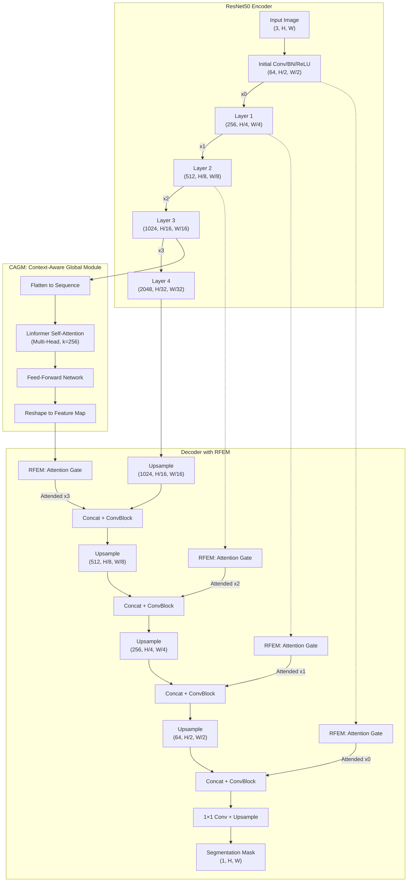

# Context-CrackNet

[](https://opensource.org/licenses/MIT)
[](https://www.python.org/downloads/)
[](https://pytorch.org/)
[](https://doi.org/10.1016/j.conbuildmat.2025.141583)

> **Context-CrackNet: A context-aware framework for precise segmentation of tiny cracks in pavement images**

Official PyTorch implementation of Context-CrackNet, a novel deep learning architecture for accurate crack detection and segmentation in pavement images. The framework combines a ResNet50 encoder backbone with two key innovations:

- **CAGM (Context-Aware Global Module)**: Linformer-based attention for efficient global context modeling with O(n·k) complexity
- **RFEM (Region Focused Enhancement Module)**: Attention-gated skip connections for selective feature enhancement

📄 **Paper**: [Construction and Building Materials (2025)](https://doi.org/10.1016/j.conbuildmat.2025.141583)

---

## 🏗️ Architecture

Context-CrackNet follows an encoder-decoder structure with skip connections enhanced by attention mechanisms:



### Key Components

| Module | Full Name | Description |
|--------|-----------|-------------|
| **CAGM** | Context-Aware Global Module | Applies Linformer self-attention to layer3 features (1024 ch) for capturing long-range dependencies with linear O(n·k) complexity instead of quadratic O(n²) |
| **RFEM** | Region Focused Enhancement Module | Attention gates on skip connections that learn to focus on crack-relevant regions by combining encoder features with decoder gating signals |
| **ResNet50 Encoder** | — | ImageNet-pretrained backbone extracting hierarchical features at 5 scales (64→256→512→1024→2048 channels) |

---

## 📁 Project Structure

```
Context-CrackNet/
├── README.md                    # This file
├── LICENSE                      # MIT License
├── requirements.txt             # Python dependencies
├── config.yaml                  # Default configuration
│
├── src/                         # Source code package
│   ├── models/
│   │   ├── context_cracknet.py  # Context_CrackNet, Context_CrackNet_ablation
│   │   ├── components.py        # ResNet50Encoder, AttentionGate, LinformerBlock
│   │   └── baselines.py         # Baseline model factory (UNet, DeepLabV3+, etc.)
│   ├── data/
│   │   └── datasets.py          # SegmentationDataset, get_dataloader
│   ├── losses/
│   │   └── losses.py            # Binary/Multiclass Dice, BCE, Focal losses
│   ├── metrics/
│   │   └── metrics.py           # IoU, Dice, Precision, Recall, F1
│   └── utils/
│       └── utils.py             # Checkpoint utilities
│
├── scripts/
│   ├── train.py                 # Training script
│   └── inference.py             # Inference script
│
└── paper.pdf                    # Research paper
```

---

## 🚀 Installation

### Requirements
- Python ≥ 3.9
- PyTorch ≥ 2.5 (with CUDA 12.1 recommended)
- CUDA (recommended for GPU training)

### Setup

```bash
# Clone the repository
git clone https://github.com/Blessing988/Context-CrackNet.git
cd Context-CrackNet

# Create virtual environment (recommended)
python -m venv venv
source venv/bin/activate  # Linux/Mac
# or
venv\Scripts\activate     # Windows

# Install dependencies
pip install -r requirements.txt
```

---

## 📊 Supported Datasets

The following public crack segmentation datasets are supported:

| Dataset | Crack Types | Surface Material | Lighting Conditions |
|---------|-------------|------------------|---------------------|
| CFD | Thin linear cracks | Asphalt pavement | Outdoor daylight, shadows, oil stains |
| CRACK500 | Hairline, wide cracks | Asphalt road surfaces | Mixed outdoor, varied weather |
| cracktree200 | Linear, alligator cracks | Asphalt pavement | Low contrast, uneven lighting |
| DeepCrack | Pavement, stone cracks | Asphalt concrete; stone | Daylight, some laser-lit |
| Eugen_Muller | Random cracks | Tunnel concrete | Tunnel lighting |
| forest | Thin linear cracks | Asphalt pavement | Outdoor daylight, shadows |
| GAPS384 | Longitudinal, transverse, block | Asphalt roads | Dry daylight |
| Rissbilder | Architectural cracks | Concrete, masonry | Varied lighting |
| Sylvie | Linear, network cracks | Asphalt pavement | Outdoor varied lighting |
| Volker | Structural cracks | Concrete facades | Field conditions, well-lit |

### Expected Dataset Structure

```
datasets/
├── DeepCrack/
│   ├── train/
│   │   ├── images/
│   │   │   ├── image1.jpg
│   │   │   └── ...
│   │   └── masks/
│   │       ├── image1.jpg
│   │       └── ...
│   └── val/
│       ├── images/
│       └── masks/
```

---

## ⚙️ Configuration

Edit `config.yaml` to configure training:

```yaml
model:
  num_classes: 1                    # Binary segmentation
  backbone: resnet50                # Encoder backbone
  pretrained: True                  # Use ImageNet pretrained weights
  architecture: Context_CrackNet    # Model architecture (see options below)
  use_dice: True                    # Use Dice loss component
  use_bce: True                     # Use BCE loss component
  use_rfem: True                    # Enable RFEM (for ablation studies)
  use_cagm: True                    # Enable CAGM (for ablation studies)

training:
  batch_size: 4
  num_epochs: 1000
  learning_rate: 0.0001
  weight_decay: 0.00001
  early_stopping_patience: 100

data:
  root_dir: '/path/to/datasets'     # ← UPDATE THIS PATH
  dataset_name: 'DeepCrack'         # Dataset to train on
  num_workers: 4

utils:
  save_dir: '/path/to/save/models'  # ← UPDATE THIS PATH
```

### Supported Architectures

| Architecture | Type | Description |
|--------------|------|-------------|
| `Context_CrackNet` | **Proposed** | Full model with CAGM + RFEM |
| `Context_CrackNet_ablation` | Proposed | Ablation variant (toggle use_rfem/use_cagm) |
| `Unet` | Baseline | U-Net |
| `UnetPlusPlus` | Baseline | U-Net++ with nested skip connections |
| `PSPNet` | Baseline | Pyramid Scene Parsing Network |
| `PAN` | Baseline | Pyramid Attention Network |
| `MAnet` | Baseline | Multi-scale Attention Network |
| `Linknet` | Baseline | Lightweight encoder-decoder |
| `FPN` | Baseline | Feature Pyramid Network |
| `DeepLabV3Plus` | Baseline | DeepLab v3+ with ASPP |
| `DeepLabV3` | Baseline | DeepLab v3 |

---

## 🏋️ Training

### Train Context-CrackNet

```bash
# Using default config.yaml
python scripts/train.py

# Using custom config
python scripts/train.py --config path/to/config.yaml
```

### Train Baseline Models

Change `architecture` in `config.yaml`:

```yaml
model:
  architecture: DeepLabV3Plus  # or Unet, PSPNet, FPN, etc.
```

Then run the same training command.

---

## 🔍 Inference

### Single Model Inference

```bash
python scripts/inference.py \
    --dataset DeepCrack \
    --architecture Context_CrackNet \
    --data_root /path/to/datasets \
    --checkpoint_root /path/to/checkpoints \
    --output_root ./predictions
```

### Batch Inference

```bash
# Run on all datasets and architectures
python scripts/inference.py --batch

# Run on specific subsets
python scripts/inference.py --batch \
    --datasets DeepCrack CRACK500 \
    --architectures Context_CrackNet Unet DeepLabV3Plus
```

---

## 📈 Evaluation Metrics

| Metric | Description |
|--------|-------------|
| **IoU** | Intersection over Union (Jaccard Index) |
| **Dice** | Dice Coefficient (F1 for segmentation) |
| **Precision** | TP / (TP + FP) |
| **Recall** | TP / (TP + FN) |
| **F1 Score** | Harmonic mean of Precision and Recall |

---

## 🧪 Ablation Studies

To run ablation experiments, use `Context_CrackNet_ablation`:

```yaml
model:
  architecture: Context_CrackNet_ablation
  use_rfem: True   # Set False to disable attention gates
  use_cagm: True   # Set False to disable Linformer block
```

| Configuration | RFEM | CAGM | Description |
|---------------|:----:|:----:|-------------|
| **Full Model** | ✓ | ✓ | Complete Context-CrackNet |
| w/o CAGM | ✓ | ✗ | Without global context module |
| w/o RFEM | ✗ | ✓ | Without attention gates |
| Baseline | ✗ | ✗ | ResNet50 encoder-decoder only |

---

## 📝 Citation

If you use this code in your research, please cite our paper:

```bibtex
@article{AGYEIKYEM2025141583,
  title = {Context-CrackNet: A context-aware framework for precise segmentation of tiny cracks in pavement images},
  journal = {Construction and Building Materials},
  volume = {484},
  pages = {141583},
  year = {2025},
  issn = {0950-0618},
  doi = {https://doi.org/10.1016/j.conbuildmat.2025.141583},
  url = {https://www.sciencedirect.com/science/article/pii/S0950061825017337},
  author = {Blessing {Agyei Kyem} and Joshua Kofi Asamoah and Armstrong Aboah},
  keywords = {Pavement distress, Segmentation, Deep learning, Cracks, Context-crackNet, Region-focused enhancement, Global context modeling}
}
```

---

## 📄 License

This project is licensed under the MIT License - see the [LICENSE](LICENSE) file for details.

---

## 🙏 Acknowledgments

- [segmentation-models-pytorch](https://github.com/qubvel/segmentation_models.pytorch) for baseline implementations
- [Linformer: Self-Attention with Linear Complexity](https://arxiv.org/abs/2006.04768)
- [Attention U-Net](https://arxiv.org/abs/1804.03999) for attention gate inspiration
